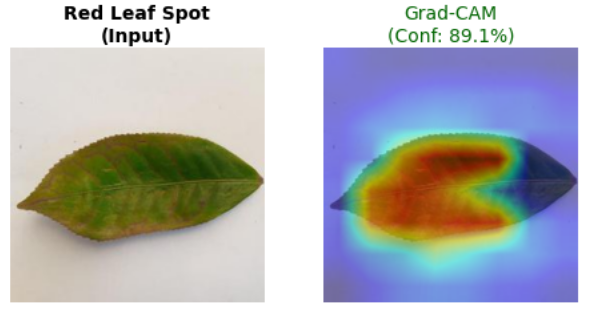

# 🍃 Explainable Tea Leaf Disease Detection

[](https://huggingface.co/spaces/AngryPakhi/tea-leaf-disease-detection)
[](https://pytorch.org/)
[](https://gradio.app/)
[](https://python.org)

An end-to-end computer vision and explainable AI (XAI) framework for identifying and diagnosing 12 distinct categories of tea leaf conditions (diseases, pests, and healthy foliage).

> ⚠️ **Academic Publication Notice**  
> *Full end-to-end training pipelines, hyperparameter search scripts, and research preprints are temporarily withheld pending conference submission & peer review. This repository provides the public web demo, visual model interpretations, and inference architecture.*

---

## 📌 Overview

Early and accurate diagnosis of foliar diseases in tea plantations is essential for yield preservation and targeted intervention. This research develops a robust computer vision pipeline designed to overcome real-world field challenges (low lighting, shadow noise, and inter-class visual similarity).

### Key Highlights:
- **High-Performance Vision Backbones**: Investigated Vision Transformers (Swin Transformer) and modern real-time architectures (YOLO11m) adapted for 12-class agricultural disease diagnosis.
- **Explainable AI (Grad-CAM)**: Integrated visual attribution maps to verify that predictions are driven by actual pathological lesions rather than environmental artifacts or leaf background.
- **Robust Generalization**: Validated against severe environmental augmentations (low-light, shadow variations, and affine distortions).
- **Interactive Web Demo**: Deployed as a web application via Hugging Face Spaces for real-time inference.

---

## 🚀 Live Demo

Experience the model in action directly in your browser:  
👉 **[Open Hugging Face Space](https://huggingface.co/spaces/AngryPakhi/tea-leaf-disease-detection)**

Upload any tea leaf image to inspect the real-time classification probability distribution.

---

## 🔬 Explainability & Visual Results

### 1. Model Interpretability (Grad-CAM)
Visual attention maps demonstrate localized activation on pathological lesion clusters:



### 2. High-Level Architecture
Pipeline schematic representing feature extraction and classification head:


### 3. Confusion Matrix
Validation performance across all 12 classes:


---

## 📂 Repository Structure

```text
Explainable-Tea-Leaf-Disease-Detection/
│
├── app/                         # Interactive Gradio web application
│   ├── app.py                   # Inference logic & UI definitions
│   ├── requirements.txt         # App dependencies
│   └── README.md                # Space metadata
│
├── assets/                      # Architectural diagrams and visualization samples
│   ├── classification architecture.png
│   ├── Confusion Matrix.jpg
│   ├── gradcam.png
│   ├── accuracy curve.jpg
│   └── loss curve.jpg
│
├── .gitignore                   # Excludes heavy weights, checkpoints & temporary data
└── README.md                    # Project documentation
```

---

## 💻 Running the Demo Locally

1. **Clone the repository:**
   ```bash
   git clone https://github.com/AsadIslam111/Explainable-Tea-Leaf-Disease-Detection.git
   cd Explainable-Tea-Leaf-Disease-Detection
   ```

2. **Install dependencies:**
   ```bash
   pip install -r app/requirements.txt
   ```

3. **Launch the application:**
   ```bash
   cd app
   python app.py
   ```

---

## 🛡️ License & Citation

This project is licensed under the MIT License - see the [app/LICENSE](app/LICENSE) file for details.

For academic inquiries or collaboration requests regarding the upcoming paper, feel free to reach out via [GitHub](https://github.com/AsadIslam111).
